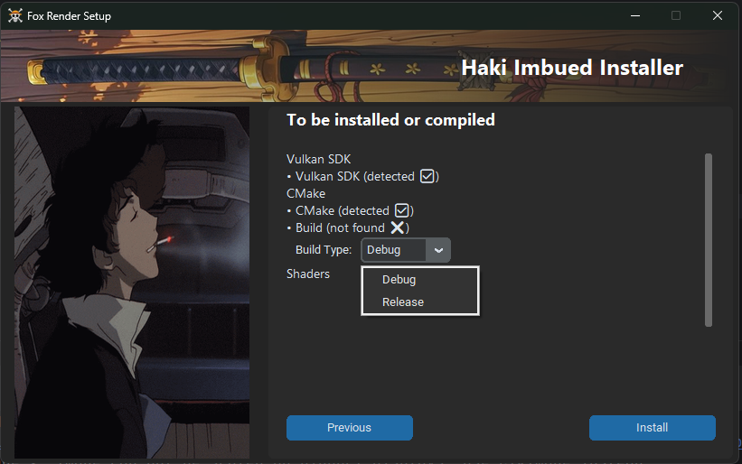

# Fox Render Playground

> Current Output: Nothing fancy yet but it'll be fun to see how far it evolves later!


This is a Windows-specific graphics project built using **Vulkan** and the **Win32 API**, designed to test and experiment with:

- Physically-Based Rendering (PBR)
- Custom shaders (GLSL/HLSL to SPIR-V)
- Vulkan raytracing extensions

---

## Requirements

- Windows 10/11
- Python 3.9+
- Vulkan SDK (1.3+) `note: can be downloaded with gui installer`
- CMake 3.90+ `note: can be downloaded with gui installer`
- Visual Studio 2019/2022 or MSVC toolchain
- GPU with raytracing support (RTX 20xx+/RX 6000+ recommended)

---

## Build Instructions

> Recommended: Use the GUI installer for first-time setup. It handles everything — installing CMake (if missing), Vulkan SDK, compiling shaders, and building the project.

### Quick Start with GUI Installer



> Note: If Vulkan is not detected after installation, ensure that the %VULKAN_SDK% environment variable is set correctly in your system’s PATH. After setting it, restart your system.
Still facing issues? Feel free to reach out at: niffoisme@gmail.com
```bash
cd FoxRenderEngine/setup
pip install -r requirements.txt
python build_installer.py
```

### Build with CMake
If you'd rather build manually:
```bash
git clone https://github.com/Niffoxic/FoxRenderEngine.git
cd FoxRenderEngine
mkdir build
cd build
cmake .. -G "Visual Studio 17 2022" -A x64 -DCMAKE_BUILD_TYPE=Debug
cmake --build . --config Debug --target CompileShaders
```

Executables should be inside build/FoxRenderEngine/

> This will automatically compile shaders via Python as part of the build process, as long as the VULKAN_SDK environment variable is set and Python is installed.

This project is licensed under the [Apache License 2.0](http://www.apache.org/licenses/LICENSE-2.0).
